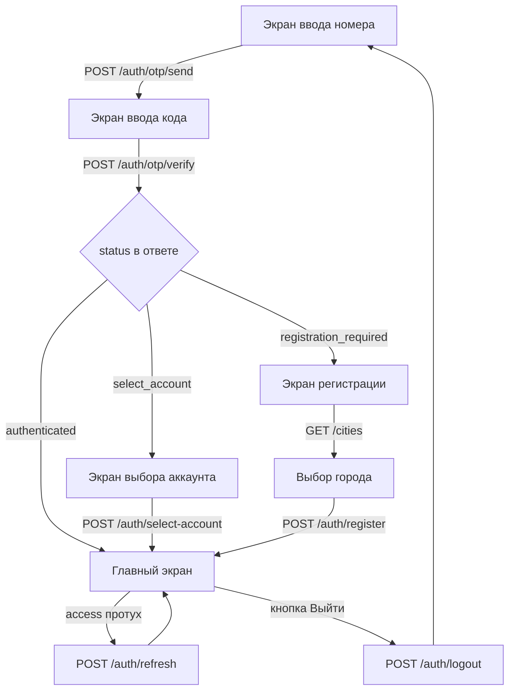

# Авторизация в клиентском мобильном приложении

Документ для мобильного разработчика. Описывает все сценарии входа, порядок вызова
эндпоинтов и обработку ошибок.

Базовый префикс: `{BASE_URL}/api/client`
Значение `{BASE_URL}` выдаётся отдельно.

Пути в разделе 4 указаны относительно этого префикса: методы авторизации живут
под `/auth`, справочник городов — прямо под `/api/client`.

---

## 1. Как устроена авторизация

Клиент входит **по номеру телефона и одноразовому коду из SMS**. Пароля нет и не будет.

Клиент приложения — это запись в справочнике `clients`, а не сотрудник компании.
Токены клиента подписываются отдельным ключом и **намеренно не работают** ни на одном
эндпоинте веб-панели (`/api/admin`, `/api/operator`, `/api/courier` и т.д.). Обратное тоже
верно. Не пытайтесь переиспользовать токен из другого приложения — получите `401`.

### Три вида токенов

| Токен | Живёт | Где хранить | Зачем |
|---|---|---|---|
| `access_token` | 24 часа | защищённое хранилище | во всех запросах, заголовок `Authorization: Bearer <token>` |
| `refresh_token` | 180 дней | защищённое хранилище | обменивается на новую пару, когда access протух |
| `pending_token` | 10 минут | только в памяти | промежуточный шаг: номер подтверждён, но аккаунт ещё не выбран |

`refresh_token` — не JWT, а непрозрачная строка. Не пытайтесь её разбирать.
При каждом вызове `/auth/refresh` **старый refresh немедленно перестаёт работать** и выдаётся новый.
Всегда сохраняйте новый, иначе следующий refresh получит `401`.

Оба долгоживущих токена кладите в Keychain (iOS) / EncryptedSharedPreferences (Android).
Не пишите их в логи и не отправляйте в аналитику.

---

## 2. Общая схема



Ключевой момент: **`/auth/otp/verify` возвращает `200` в трёх разных ситуациях**. Разветвляйтесь
по полю `status`, а не по HTTP-коду.

---

## 3. Формат номера телефона

Отправляйте как удобно — бэкенд нормализует сам. Все варианты ниже равнозначны:

```
+99365717001    99365717001    65717001    65 71 70 01
```

**Требование одно: после удаления всех нецифровых символов и кода страны `993` должно
остаться ровно 8 цифр.** Иначе придёт `400`.

Рекомендация для UI: поле ввода с несъёмным префиксом `+993` и маской на 8 цифр.

Городские номера Ашхабада (`12XXXXXX`) тоже принимаются — они есть у части клиентов.
Но SMS на них не доходит, поэтому пользователь застрянет на экране ввода кода. Стоит
показать подсказку «код придёт только на мобильный номер».

---

## 4. Эндпоинты

### 4.1 GET `/cities` — список городов

Заголовок авторизации не нужен: справочник требуется на экране регистрации, когда
токена доступа ещё нет.

**200**

```json
[
  { "id": 2, "name": "Ahal" },
  { "id": 1, "name": "Aşgabat" }
]
```

Отсортировано по названию. Отдаются **только активные** города — заблокированные
в выдачу не попадают, и `/auth/register` их не примет.

Список короткий: на сегодня активных городов **два** из пяти в справочнике.
Не рассчитывайте на длинный список, но и не хардкодьте — оператор может включить
остальные в любой момент. Кэшировать на время сессии можно, между запусками — не стоит.

---

### 4.2 POST `/auth/otp/send` — запросить код

Заголовок авторизации не нужен.

```json
{ "phone": "+99365717001" }
```

**200** — код отправлен

```json
{ "status": "sent", "expires_in": 300, "resend_after": 60 }
```

`expires_in` — сколько секунд код будет действителен (300).
`resend_after` — через сколько секунд можно нажать «отправить повторно» (60).
Запустите таймер обратного отсчёта на кнопке по этому значению.

**400** — номер не прошёл проверку формата

```json
{ "error": "Неверный формат номера. Введите 8 цифр" }
```

**429** — сработал лимит

```json
{ "error": "Повторная отправка возможна через 43 сек.", "retry_after": 43 }
```

Два разных лимита, оба отдают `429` с полем `retry_after` в секундах:
повтор не чаще одного раза в 60 секунд и не более 5 кодов на номер в час.

**502** — SMS-шлюз недоступен

```json
{ "error": "Не удалось отправить SMS. Попробуйте позже", "detail": "..." }
```

Показывайте пользователю только `error`. Поле `detail` — для ваших логов.
Лимит при такой ошибке **не расходуется**, повторить можно сразу.

---

### 4.3 POST `/auth/otp/verify` — проверить код

Заголовок авторизации не нужен.

```json
{
  "phone": "+99365717001",
  "code": "3892",
  "device_info": "iPhone 15 Pro, iOS 18.2"
}
```

`device_info` необязателен, но передавайте — он показывается в списке устройств
и помогает разбирать обращения в поддержку. Максимум 255 символов.

Дальше — три возможных ответа, все со статусом `200`.

#### Исход A: `authenticated` — номер принадлежит одному клиенту

Самый частый случай.

```json
{
  "status": "authenticated",
  "access_token": "eyJhbGciOiJIUzI1NiIs...",
  "refresh_token": "bYRxUb_TXpPQkciJDPtjKAnUeO6b9MthLgnNFeuswZk",
  "token_type": "Bearer",
  "expires_in": 86400,
  "client": {
    "id": 6785,
    "full_name": "Merdan",
    "is_active": true,
    "created_at": "2026-07-02T11:36:29",
    "price_type_id": 1,
    "price_type_name": "Rayat",
    "city_id": null,
    "city_name": null,
    "language": null
  }
}
```

Сохраняйте оба токена, переходите на главный экран.

`city_id` и `language` будут `null` у всех клиентов, заведённых оператором до появления
приложения — профиль в приложении у них ещё не создан. Учитывайте это: если `city_id` пустой,
город для каталога надо брать из адреса клиента либо спросить у пользователя.

#### Исход B: `select_account` — номер привязан к нескольким карточкам

В базе 135 таких номеров, они затрагивают 301 клиента. Обычно это один и тот же человек,
заведённый оператором дважды.

```json
{
  "status": "select_account",
  "pending_token": "eyJhbGciOiJIUzI1NiIs...",
  "accounts": [
    {
      "id": 18,
      "full_name": " ",
      "address": "Ahal, Ak Tam, Nohurly bazar 16A blok",
      "orders_count": 2,
      "last_order_at": "2026-04-06T17:32:45"
    },
    {
      "id": 20,
      "full_name": "Merdan",
      "address": "Aşgabat, 30mkr, Gurbandurdy köçe, dom 60/1",
      "orders_count": 17,
      "last_order_at": "2026-07-19T09:12:03"
    }
  ]
}
```

Токенов здесь **нет**. Покажите экран выбора и вызовите `/auth/select-account`.

Важно для вёрстки: **у 42% клиентов `full_name` — это `.`, `-`, пробел или цифры.**
По одному имени человек себя не узнает. Обязательно выводите `address` и `last_order_at`,
это главные опознавательные признаки. `address` и `last_order_at` могут быть `null`,
если у карточки нет адреса или заказов — предусмотрите заглушку.

Сортируйте список по `last_order_at` по убыванию: свежая карточка почти всегда нужная.

#### Исход C: `registration_required` — номера нет в базе

```json
{
  "status": "registration_required",
  "pending_token": "eyJhbGciOiJIUzI1NiIs..."
}
```

Ведите на экран регистрации и вызывайте `/auth/register`.

#### Ошибки `/auth/otp/verify`

**400** — код не подошёл. Текст в `error` уже готов к показу:

```
"Код не запрашивался или уже использован"
"Неверный код. Осталось попыток: 4"
"Исчерпаны попытки ввода. Запросите новый код"
"Срок действия кода истёк. Запросите новый"
"Введите код из SMS"
```

Попыток даётся 5. После пятой код гасится окончательно — даже правильный код уже
не сработает, нужен новый запрос. Ловите фразу «Запросите новый код» и возвращайте
пользователя к кнопке повторной отправки.

**403** — все карточки с этим номером заблокированы

```json
{ "error": "Аккаунт заблокирован. Обратитесь в колл-центр" }
```

---

### 4.4 POST `/auth/select-account` — выбрать аккаунт

Вызывается только после исхода B. Заголовок авторизации не нужен.

```json
{
  "pending_token": "eyJhbGciOiJIUzI1NiIs...",
  "client_id": 20,
  "device_info": "iPhone 15 Pro, iOS 18.2"
}
```

**200** — ответ идентичен исходу A: `status`, оба токена, `client`.

| Код | Когда | Что делать |
|---|---|---|
| `400` | не передан `client_id` | ошибка в коде приложения |
| `401` | `pending_token` истёк или испорчен | вернуть на ввод номера, начать заново |
| `403` | выбран `client_id` не из выданного списка, либо этот аккаунт заблокирован | показать `error` |

`pending_token` живёт 10 минут. Если пользователь ушёл из приложения и вернулся позже,
повторите цикл с `/auth/otp/send`.

---

### 4.5 POST `/auth/register` — зарегистрировать нового клиента

Вызывается только после исхода C. Заголовок авторизации не нужен.

```json
{
  "pending_token": "eyJhbGciOiJIUzI1NiIs...",
  "full_name": "Merdan Ataýew",
  "city_id": 1,
  "device_info": "iPhone 15 Pro, iOS 18.2"
}
```

Оба поля обязательны. Город нужен, потому что цены на услуги задаются отдельно
для каждого города — без него нечего показать в каталоге. `city_id` берите
из `GET /cities` (раздел 4.1).

**201** — ответ идентичен исходу A.

| Код | Когда | Текст |
|---|---|---|
| `400` | пустое имя или нет города | «Укажите имя» / «Выберите город» |
| `401` | `pending_token` истёк | «Сессия подтверждения истекла. Запросите код заново» |
| `404` | города с таким `id` нет или он отключён | «Город не найден» |
| `409` | номер успели зарегистрировать между `verify` и `register` | «Этот номер уже зарегистрирован. Запросите код заново» |

При `409` и `401` возвращайте пользователя к вводу номера.

`404` придёт и в том случае, если город существует, но отключён оператором. Такого города
не будет в выдаче `GET /cities`, поэтому при нормальной работе приложения этот код
означает, что список городов устарел — перезапросите его.

---

### 4.6 POST `/auth/refresh` — обновить пару токенов

Заголовок авторизации не нужен, авторизацией служит сам refresh.

```json
{ "refresh_token": "bYRxUb_TXpPQkciJDPtjKAnUeO6b9MthLgnNFeuswZk" }
```

**200**

```json
{
  "access_token": "...",
  "refresh_token": "...",
  "token_type": "Bearer",
  "expires_in": 86400
}
```

**Оба токена меняются.** Перезаписывайте сохранённую пару целиком. Старый refresh
отзывается в тот же момент — повторный вызов с ним вернёт `401`.

| Код | Когда | Что делать |
|---|---|---|
| `400` | не передан `refresh_token` | ошибка в коде приложения |
| `401` | токен неизвестен, уже использован, отозван или истёк | разлогинить, экран ввода номера |
| `403` | клиента заблокировали | показать `error`, разлогинить |

Профиль клиента в ответе не приходит. Если он нужен — вызовите `/auth/me`.

---

### 4.7 POST `/auth/logout` — выйти

Требует заголовок `Authorization: Bearer <access_token>`.

Выход с текущего устройства:

```json
{ "refresh_token": "bYRxUb_TXpPQkciJDPtjKAnUeO6b9MthLgnNFeuswZk" }
```

Выход со всех устройств:

```json
{ "all_devices": true }
```

Если не передать ничего — отзываются все refresh-токены клиента.

**200**

```json
{ "status": "success", "message": "Вы вышли из аккаунта" }
```

Access-токен остаётся технически валидным до конца своих 24 часов — отозвать JWT нельзя.
Поэтому **обязательно удаляйте оба токена из хранилища на устройстве** сразу после ответа.

---

### 4.8 GET `/auth/me` — профиль

Требует заголовок `Authorization: Bearer <access_token>`.

Вызывайте при холодном старте, чтобы проверить, жива ли сессия, и получить актуальные данные.

**200**

```json
{
  "authenticated": true,
  "client": {
    "id": 6785,
    "full_name": "Merdan",
    "is_active": true,
    "created_at": "2026-07-02T11:36:29",
    "price_type_id": 1,
    "price_type_name": "Rayat",
    "city_id": 1,
    "city_name": "Aşgabat",
    "language": "ru"
  },
  "phones": [
    { "id": 9474, "phone": "+99362164202" }
  ],
  "addresses": [
    {
      "id": 8485,
      "city_id": 1,        "city_name": "Aşgabat",
      "district_id": 141,  "district_name": "Mir7",
      "street_id": 1,      "street_name": "Wagtlaýyn",
      "address_line": "sanly ulgam edarasy yunus emran ugrunda",
      "appartment": "kw 20",
      "entrance": "podyez 4",
      "floor": "etaz 2"
    }
  ]
}
```

Возвращаются только активные адреса.

Поле называется **`appartment`** — с двумя `p`. Это опечатка в схеме базы, которую
нельзя исправить без ломки веб-панели. Пишите именно так.

Поля `district_name`, `street_name`, `address_line` в реальных данных бывают
замусорены — `-`, `.`, пустая строка. Не полагайтесь на них при вёрстке,
предусматривайте пустые значения.

**401** — токен отсутствует, испорчен или истёк.
**403** — клиента заблокировали.

---

## 5. Последовательности вызовов

### Первый вход, обычный клиент

```
1. POST /auth/otp/send    { phone }
2. POST /auth/otp/verify  { phone, code, device_info }
                          → status: "authenticated"
3. сохранить access_token и refresh_token
4. главный экран
```

### Первый вход, номер у нескольких карточек

```
1. POST /auth/otp/send       { phone }
2. POST /auth/otp/verify     { phone, code, device_info }
                             → status: "select_account", pending_token, accounts[]
3. показать список, пользователь выбирает
4. POST /auth/select-account { pending_token, client_id, device_info }
                             → status: "authenticated"
5. сохранить оба токена
```

### Первый вход, новый номер

```
1. POST /auth/otp/send    { phone }
2. POST /auth/otp/verify  { phone, code, device_info }
                          → status: "registration_required", pending_token
3. GET  /cities           → список для выпадающего поля
4. POST /auth/register    { pending_token, full_name, city_id, device_info }
                          → 201, status: "authenticated"
5. сохранить оба токена
```

Города можно запросить заранее, пока пользователь вводит код, — эндпоинт не требует
авторизации. Так экран регистрации откроется без задержки.

### Повторный запуск приложения

```
1. прочитать access_token из хранилища
   нет токена → экран ввода номера
2. GET /auth/me  с Bearer
   200 → главный экран
   401 → перейти к шагу 3
   403 → показать error, стереть токены, экран ввода номера
3. POST /auth/refresh { refresh_token }
   200 → перезаписать ОБА токена, повторить шаг 2
   401 → стереть токены, экран ввода номера
   403 → показать error, стереть токены, экран ввода номера
```

### Выход

```
1. POST /auth/logout  { refresh_token }   с Bearer
2. стереть оба токена из хранилища
3. экран ввода номера
```

---

## 6. Перехватчик запросов

Логику обновления токена удобно один раз положить в HTTP-перехватчик.

```
на каждый запрос:
    добавить заголовок Authorization: Bearer <access_token>

если пришёл 401 и запрос не является /auth/refresh:
    взять блокировку (иначе параллельные запросы сожгут refresh друг друга)
    если пара токенов уже обновлена другим потоком — просто повторить запрос
    иначе:
        POST /auth/refresh { refresh_token }
        200 → сохранить ОБА новых токена, повторить исходный запрос один раз
        иное → разлогинить, экран ввода номера
    снять блокировку

если пришёл 403 с текстом про блокировку:
    разлогинить, показать error
```

**Обязательно блокируйте параллельные обновления.** Refresh ротируется: если два запроса
одновременно получат `401` и оба дёрнут `/auth/refresh`, второй придёт с уже отозванным токеном
и получит `401` — пользователя выкинет из приложения без причины.

Повторять исходный запрос после обновления нужно **ровно один раз**, иначе можно
уйти в бесконечный цикл.

---

## 7. Сводка кодов ответа

| Код | Значение | Реакция приложения |
|---|---|---|
| `200` | успех, у `/auth/otp/verify` — смотреть поле `status` | по сценарию |
| `201` | клиент зарегистрирован | сохранить токены |
| `400` | ошибка ввода, текст готов к показу | показать `error` под полем |
| `401` | нет авторизации, токен протух или отозван | обновить токен либо разлогинить |
| `403` | аккаунт заблокирован, либо чужой `client_id` | показать `error`, разлогинить |
| `404` | город не найден | показать `error` |
| `409` | номер зарегистрирован конкурентно | вернуть на ввод номера |
| `429` | лимит запросов, смотреть `retry_after` | таймер на кнопке |
| `502` | SMS-шлюз недоступен | «попробуйте позже», повтор разрешён сразу |
| `500` | ошибка сервера | «попробуйте позже», записать в лог |

Во всех ошибках приходит поле `error` с готовым текстом на русском. Показывайте его
как есть — тексты согласованы с остальной системой.

---

## 8. Что нужно учесть до релиза

**Сервер сейчас работает по HTTP без TLS.** Это блокирует публикацию приложения:
Android с API 28 запрещает cleartext-трафик по умолчанию, iOS требует исключения в ATS,
которое Apple на ревью заворачивает. Плюс код из SMS и токены идут по сети открытым текстом.
Нужен домен и HTTPS — вопрос решается на стороне бэкенда, но заложите время в план.

**Не логируйте токены и коды.** Ни в консоль, ни в Crashlytics, ни в аналитику.

**Не кэшируйте ответ `/auth/me` надолго.** Клиента может заблокировать оператор, и приложение
должно это заметить.

---

## 9. Проверка на тестовых данных

Сценарии удобно воспроизводить на копии боевой базы:

| Что проверить | Как подобрать номер |
|---|---|
| `authenticated` | любой номер, привязанный ровно к одной активной карточке |
| `select_account` | `62654545` — четыре карточки: 18, 20, 21, 22 |
| `registration_required` | любой свободный 8-значный номер |
| блокировка | `64061117` — единственная карточка, заблокирована |
| список городов | активны `1 Aşgabat` и `2 Ahal`, остальные три отключены |

При тестировании учитывайте лимиты: повтор кода не чаще раза в 60 секунд
и не более 5 кодов на номер в час.

Все перечисленные сценарии прогнаны на копии боевой базы, включая ветку с
заблокированным городом при регистрации.
